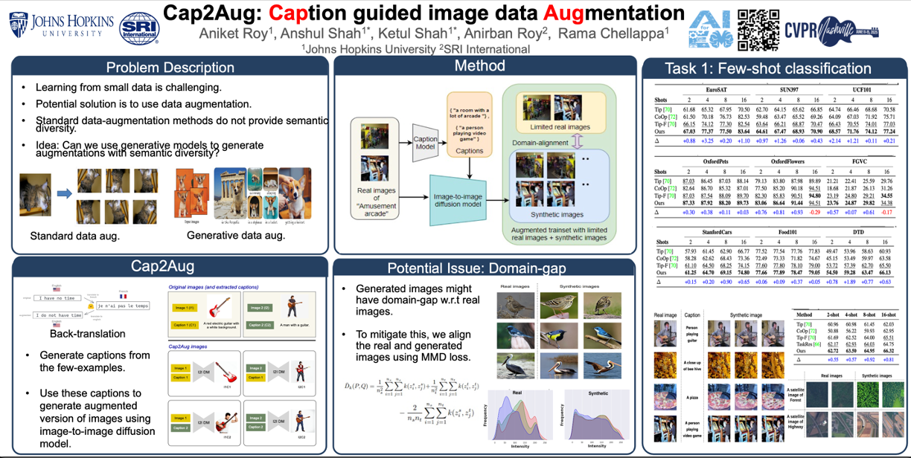

# Cap2Aug: Caption guided Image data Augmentation
Official implementation of ['Cap2Aug: Caption guided Image data Augmentation'](https://openaccess.thecvf.com/content/WACV2025/papers/Roy_Cap2Aug_Caption_Guided_Image_Data_Augmentation_WACV_2025_paper.pdf).

The paper has been accepted by **WACV 2025, MAR@CVPR 2025**.
## Introduction

Visual recognition in a low-data regime is challenging and often prone to overfitting. To mitigate this issue, several data augmentation strategies have been proposed. However, standard transformations, e.g., rotation, cropping, and flip- ping provide limited semantic variations. To this end, we propose Cap2Aug, an image-to-image diffusion model-based data augmentation strategy using image captions to condi- tion the image synthesis step. We generate a caption for an image and use this caption as an additional input for an image-to-image diffusion model. This increases the semantic diversity of the augmented images due to caption condition- ing compared to the usual data augmentation techniques. We show that Cap2Aug is particularly effective where only a few samples are available for an object class. However, naively generating the synthetic images is not adequate due to the domain gap between real and synthetic images. Thus, we employ a maximum mean discrepancy loss to align the synthetic images to the real images to minimize the domain gap. We evaluate our method on few-shot classification and image classification with long-tail class distribution tasks. Cap2Aug achieves state-of-the-art performance on both tasks while evaluated on eleven benchmarks. 

<div align="center">
  
</div>

## Requirements
### Installation
Create a conda environment and install dependencies:
```bash
git clone https://github.com/aniket004/Cap_2_Aug.git
cd Cap_2_Aug

conda create --name Cap2Aug --file requirements.txt
```

### Dataset
Follow [DATASET.md](https://github.com/gaopengcuhk/Tip-Adapter/blob/main/DATASET.md) to install ImageNet and other 10 datasets referring to CoOp.

## Get Started
### Configs
The running configurations can be modified in `configs/dataset.yaml`, including shot numbers, visual encoders, and hyperparamters. 

For simplicity, we provide the hyperparamters achieving the overall best performance on 1\~16 shots for a dataset, which accord with the scores reported in the paper. If respectively tuned for different shot numbers, the 1\~16-shot performance can be further improved. You can edit the `search_scale`, `search_step`, `init_beta` and `init_alpha` for fine-grained tuning.

Note that the default `load_cache` and `load_pre_feat` are `False` for the first running, which will store the cache model and val/test features in `configs/dataset/`. For later running, they can be set as `True` for faster hyperparamters tuning.

## Adjust paths
Please adjust paths to store the captions, and caption-genearted synthetic images. 

###  Running Baseline
For ImageNet dataset:
```bash
CUDA_VISIBLE_DEVICES=0 python main_imagenet.py --config configs/imagenet.yaml --mode baseline
```
For other 10 datasets:
```bash
CUDA_VISIBLE_DEVICES=0 python main.py --config configs/dataset.yaml --mode baseline
```

### Running Cap2Aug
For ImageNet dataset:
```bash
CUDA_VISIBLE_DEVICES=0 python main_imagenet.py --config configs/imagenet.yaml --shots 2 --mode None --mmd_coeff=0.01 --use_mmd=True --train_epoch=100
```
For other 10 datasets:
```bash
CUDA_VISIBLE_DEVICES=0 python main.py --config configs/dataset.yaml --shots 2 --mode None --mmd_coeff=0.01 --use_mmd=True --train_epoch=100
```

## Contributors
[Aniket Roy](https://github.com/aniket004)

## Acknowledgement
This repo benefits from [CLIP](https://github.com/openai/CLIP), [CoOp](https://github.com/KaiyangZhou/Dassl.pytorch) and [CLIP-Adapter](https://github.com/gaopengcuhk/CLIP-Adapter), and [Tip-Adapter](https://github.com/gaopengcuhk/Tip-Adapter). Thanks for their wonderful works.

## Citation
```bash
@inproceedings{roy2025cap2aug,
  title={Cap2Aug: Caption Guided Image data Augmentation},
  author={Roy, Aniket and Shah, Anshul and Shah, Ketul and Roy, Anirban and Chellappa, Rama},
  booktitle={2025 IEEE/CVF Winter Conference on Applications of Computer Vision (WACV)},
  pages={9125--9135},
  year={2025},
  organization={IEEE}
}
```

## Contact
If you have any question about this project, please feel free to contact ank.roy4@gmail.com.
